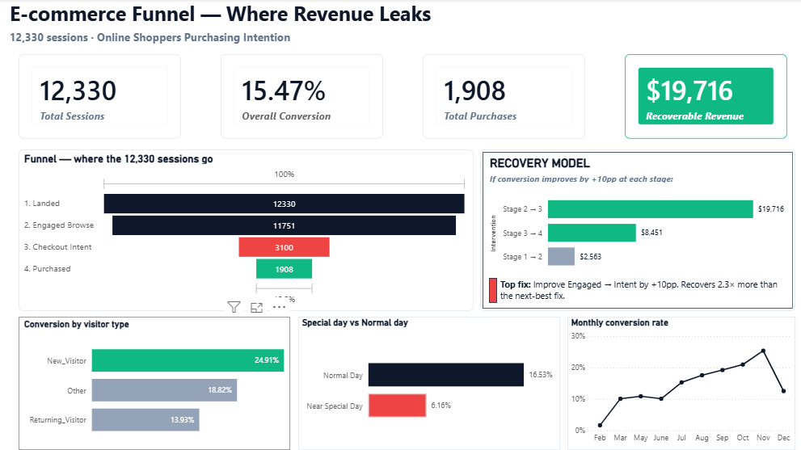

# E-commerce Checkout Funnel — Revenue Leak Analysis

> **TL;DR:** Identified $19,716 in recoverable revenue (74% of total leak) by analyzing a 4-stage e-commerce checkout funnel on 12,330 sessions. Ranked 3 ops interventions by ROI using a counterfactual model.

## Problem

E-commerce sites lose most users between landing and checkout. The question this project answers: **where in the funnel is the biggest revenue leak, and how much is fixing it worth?**

## Dataset

UCI Online Shoppers Purchasing Intention Dataset — 12,330 sessions, 17 behavioral features + binary purchase outcome.
Source: https://archive.ics.uci.edu/dataset/468/online+shoppers+purchasing+intention+dataset

## Methodology

1. **SQL (MySQL):** Cleaned the raw CSV, defined a strictly-nested 4-stage funnel:
   - **Landed** — all sessions
   - **Engaged Browse** — viewed ≥2 product pages OR has product browse time OR has PageValue
   - **Checkout Intent** — has PageValue > 0
   - **Purchased** — Revenue = TRUE
2. **Segment analysis:** Computed conversion by VisitorType, Weekend/Weekday, SpecialDay proximity, Month
3. **Counterfactual model:** Quantified incremental revenue if each stage's conversion improved by +10 percentage points, holding other stages constant
4. **Power BI dashboard:** Surfaced the leak + recovery model to a single executive view

## Key Findings

- **Biggest leak: Engaged → Intent (Stage 2→3).** Only 26% of engaged browsers reach a value-tracked page.
- **Recoverable revenue from a +10pp fix on Stage 2→3: $19,716** — 2.3× more than any other intervention.
- **Counterintuitive: new visitors convert 1.8× better than returning** (24.9% vs 13.9%). Marketing channels deliver high-intent traffic.
- **Counterintuitive: sessions near special shopping days convert 2.7× worse** than normal days (6.2% vs 16.5%). Likely price-shoppers comparing deals.
- **PageValue is the strongest predictor.** Sessions with PageValue > 100 convert at 87%; sessions with PageValue = 0 convert at 3.9%.

## Recovery Model

| Intervention | Recoverable Revenue | Rank |
|---|---|---|
| +10pp on Stage 2→3 (Engaged → Intent) | **$19,716** | #1 |
| +10pp on Stage 3→4 (Intent → Purchase) | $8,451 | #2 |
| +10pp on Stage 1→2 (Landed → Engaged) | $2,563 | #3 |

## Tech Stack

- **Database:** MySQL 8.0 (data load, funnel definition, segment analysis)
- **Modeling:** DAX (calculated tables, measures, sort-by columns)
- **Visualization:** Power BI Desktop
- **Other:** Excel (data validation), Git/GitHub

## File Structure

    ecommerce-funnel-revenue-leak/
    ├── data/
    │   └── online_shoppers_intention.csv
    ├── sql/
    │   ├── 01_setup.sql
    │   ├── 02_funnel_construction.sql
    │   ├── 03_segment_analysis.sql
    │   ├── 04_special_day_analysis.sql
    │   ├── 05_browser_vs_buyer.sql
    │   └── 06_counterfactual_model.sql
    ├── outputs/
    │   ├── funnel_dashboard.pbix
    │   └── dashboard_screenshot.png
    └── README.md

## How to Reproduce

1. Clone this repo
2. Run `sql/01_setup.sql` against MySQL to create the `funnel_analysis` database and load the dataset
3. Run `sql/02-06` in sequence to compute funnel metrics
4. Open `outputs/funnel_dashboard.pbix` in Power BI Desktop
5. Edit the MySQL data source connection if needed (Home → Transform data → Data source settings)

## Author

Isha Jangid · [LinkedIn](https://www.linkedin.com/in/ishajangid/) · ishajangid1802@gmail.com

